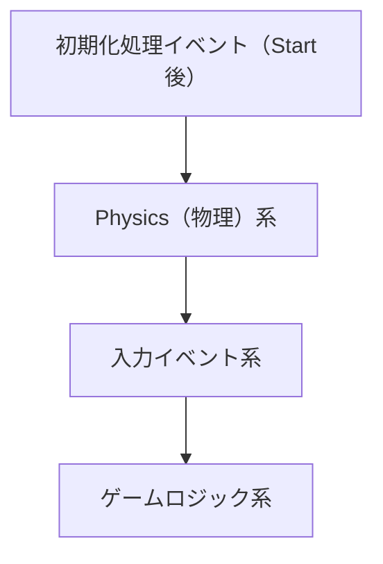
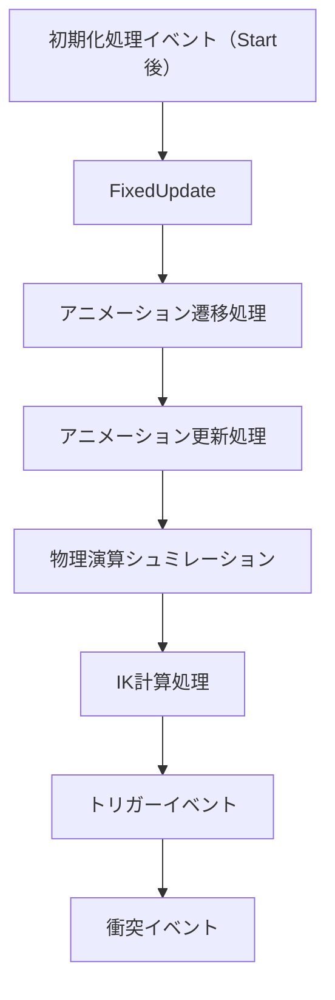
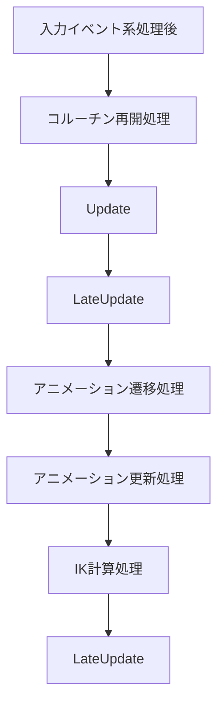
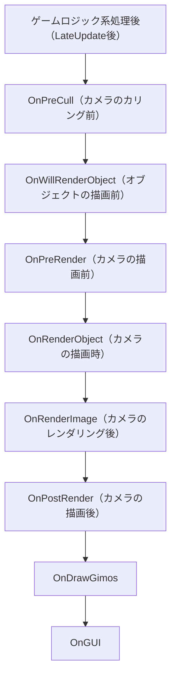

# 🐧イベント実行順序を知ることの何が大事なの？
 - Unityのイベント実行順序を把握しておかないと、予期せぬタイミングで処理を呼び出してバグを生む可能性があります。
 - 実行順序を押さえた上で開発することで安全なコーディングができ、既存のプロジェクトコードの罠を防ぐことができます。
 - 筆者もUnity使って雰囲気で開発をしている状態の時に、**Awake**, **Start**, **Update**周りで混乱した経験があるのでここに残しておきます。
 - この記事はUnity開発する人が最低限持っていてほしい知識というレベルの内容になります。
 - 詳しいイベント実行順序について知りたい方は下記URLの公式ドキュメントをご参照ください。
https://docs.unity3d.com/ja/2022.3/Manual/ExecutionOrder.html#FirstSceneLoad
---
 - 前回は[初期化処理関するイベント実行順序](https://zenn.dev/yumizu9763/articles/5654c2e4a72c2a)について説明しました。
 - 今回はアップデートに関するイベント実行順序についてです。

# 🐧大まかなライフサイクルを知ろう！
 - 前回同様Unityのイベントを大きい括りで見てみると下記のような順番で動いています。
 
     1. 初期化処理
        - Awake, Startなど
     2. ループ処理（物理演算）
        - FixedUpdate, OnTriggerXXX, OnCollisionXXXなど
     3. 入力イベント処理
        - OnMouseXXXなど
     4. ループ処理（ゲームロジック）
        - Update, LateUpdateなど
     5. 描画処理（シーン）
     6. 描画処理（UI）
        - OnGUI

# 🐧ループ処理の実行順序を知ろう！
 - ループ処理はいろんなイベントが実行されます。
 - Physics(物理)系、入力イベント系、ゲームロジック系の3つでそれぞれ見ていきましょう



# 🐧Physics系イベントの実行順序を知ろう！
### FixedUpdate
 - この関数は固定ステップで呼ばれます。
 - **固定ステップ** = ゲームのフレームレートに依存せず、一定の時間間隔（デフォルトでは0.02秒）で呼び出されるため、物理シミュレーションが安定します。
 - ex1) 固定タイムステップの動作例
    ```
    フレーム1
     ・ フレームが開始されます。
     ・ FixedUpdateが呼ばれます。
     ・ フレームのレンダリングが行われます。
    フレーム2
     ・ フレームが開始されます。
     ・ 物理シミュレーションの時間が0.02秒に達していないため、FixedUpdate は呼ばれません。
     ・ フレームのレンダリングが行われます。
    フレーム3
     ・ フレームが開始されます。
     ・ 物理シミュレーションの時間が0.02秒に達したため、FixedUpdateが呼ばれます。
     ・ フレームのレンダリングが行われます。
    ```
### OnStateMachine（Enter/Exit）
 - Unityのアニメーションステートマシンに関連するコールバックメソッドです。StateMachineBehaviourクラスを使用してアニメーションステートマシン内の特定の状態に入るときと出るときに呼び出されます。
 - これらは、アニメーションの遷移管理で遷移時に必要な処理を行えます。
 - ※StateMachineBehaviourを継承したオブジェクトのみ発生します。
### OnAnimationMove
 - アニメーションがオブジェクトのTransformの変更を行う際に使用されるメソッドです。
 - 特定の軸のみ適用させるように制限をかけたりできます。
 - デフォルトではルートアニメーションから適用されます。
### 物理演算シュミレーション
 - 実際に物理エンジンのシュミレーションを行います。
 - シュミレーションによって後の衝突イベントなどを発行します。
### OnAnimationIK
 - IK関連計算処理を行うためのコールバック関数です。
### **OnTriggerEnter**, **OnTriggerStay**, **OnTriggerExit**
 - トリガーイベントの検知した際に呼ばれます。
### **OnCollisionEnter**, **OnCollisionStay**, **OnCollisionExit**
 - 衝突イベントの検知した際に呼ばれます。


# 🐧入力系イベントの実行順序を知ろう！
 - Physics系の処理が終われば入力処理が行われます
### OnMouseXXX
 - 各フレームで入力デバイスの状態をみてイベントを実行されます
# 🐧ゲームロジック系イベントの実行順序を知ろう！
### コルーチン再開処理
 - yieldで中断した処理が条件を満たして再開する時に、このタイミング(Update前)で処理します。
### Update
 - 毎フレーム呼び出されるメインの更新メソッドです。
 - ゲームのロジック、オブジェクトの位置や状態の更新などフレームごとに必要な処理をここで行います。
### OnStateMachine（Enter/Exit）
 - Unityのアニメーションステートマシンに関連するコールバックメソッドです。StateMachineBehaviourクラスを使用してアニメーションステートマシン内の特定の状態に入るときと出るときに呼び出されます。
 - これらは、アニメーションの遷移管理で遷移時に必要な処理を行えます。
 - ※StateMachineBehaviourを継承したオブジェクトのみ発生します。
### OnAnimationMove
 - アニメーションがオブジェクトのTransformの変更を行う際に使用されるメソッドです。
 - 特定の軸のみ適用させるように制限をかけたりできます。
 - デフォルトではルートアニメーションから適用されます。
### OnAnimationIK
 - IK関連計算処理を行うためのコールバック関数です。
### LateUpdate
 - Updateの後に毎フレーム呼び出されます。
 - 通常、カメラの追従やオブジェクトの位置の最終調整などに使用されます。
     - 具体的には、Updateでキャラクターの更新することでLateUpdateで確実に更新したキャラクター情報を元にカメラの追従などを行う。


# 🐧レンダリング系イベントの実行順序を知ろう！
 - ゲームロジック系の処理が終わった後、レンダリングに入ります
### OnPreCull
 - カメラがシーンをカリングする前に呼び出されます。
 - ここで、カリング（視界内のオブジェクトを決定する処理）の前にカメラやオブジェクトの状態を変更できます。
### OnWillRenderObject
 - カメラがオブジェクトをレンダリングする直前に各オブジェクトごとに呼び出されます。
 - 各レンダリング対象オブジェクトの状態をここで変更できます。
### OnPreRender
 - カメラがレンダリングを開始する前に呼び出されます。
 - カメラ固有の設定やエフェクトを適用するときに使用します。
### OnRenderObject
 - カメラがオブジェクトをレンダリングする間に呼び出されます。
 - カメラのビューをレンダリングする間に追加の描画操作を行う場合に使用されます。
### OnRenderImage
 - カメラがシーンをレンダリングした後、ポストプロセスエフェクトを適用する際に呼び出されます。
 - ここではカメラの出力に対しての処理を行うことができます。
### OnPostRender
 - カメラがシーンをレンダリングした後に呼び出されます。
 - シーンのレンダリングが完了した後のカメラに対する操作を行う場合に使用されます。
### OnDrawGizmos
 - ギズモを描画するためのコールバックです。
 - シーンビューでのデバッグ目的でオブジェクトや状態を視覚化するために使用されます。
 - ※ゲームの実行中およびエディターでのみ有効ですのでゲームビルドには含まれません。
### OnGUI
 - IMGUIシステムを使用したUI描画用メソッドです。
 - 全てが描画された後に実行されます。
 - ※現在OnGUIは非推奨とされ、よりパフォーマンスの高いUIシステムであるUnityUI（uGUI）やUIToolkitの使用が推奨されています。
     - OnGUIは毎フレーム呼ばれるためパフォーマンス的な問題があります。



# 🐧アニメーション系処理が２回行われる理由！
 - 物理演算の結果に応じてアニメーションを更新するために、Physics系の処理とゲームロジック系の処理の両方でアニメーション関連の処理が行われる必要があります。
### Physics系
 - 物理演算によってオブジェクトの位置や状態が変化する可能性があります。
 - そのため、物理演算後にアニメーション関連の処理を行うことで、物理演算によって変更された状態を反映することができます。
### ゲームロジック系
 - ゲームロジック系の処理では、一般的にゲームの状態やオブジェクトの挙動を更新します。
 - 物理演算によって変更された状態を考慮してアニメーションを更新する必要があるので、ゲームロジック系の処理の後にもう一度アニメーション関連の処理が行われます。

# 🐧フレームの終了タイミングを知ろう！
 - 描画処理が終わればフレームの終了です。
 - コルーチンの**yield WaitForEndOfFrame**はこのタイミングで条件を満たします。
 - 以上がフレーム内のイベント実行処理の流れになります。
---


