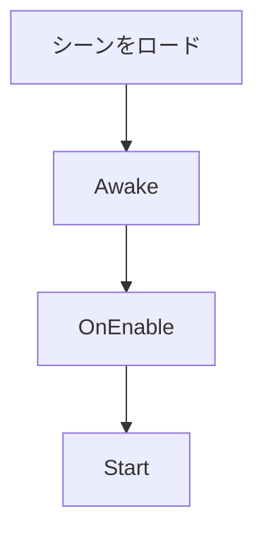
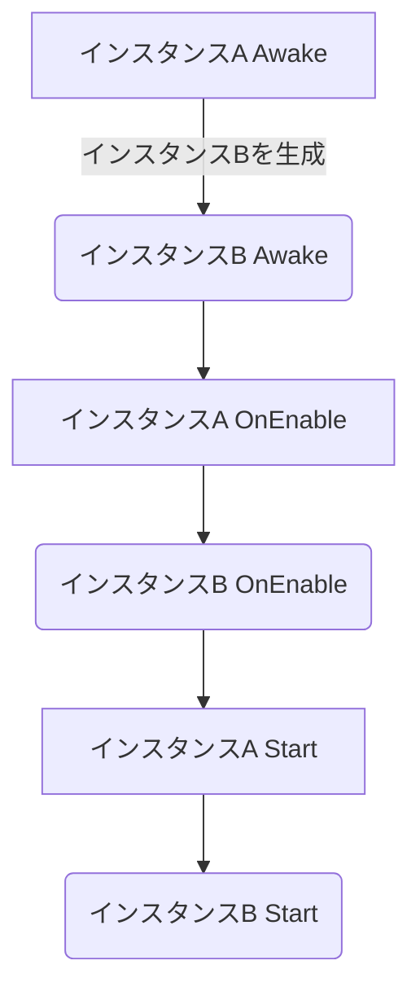
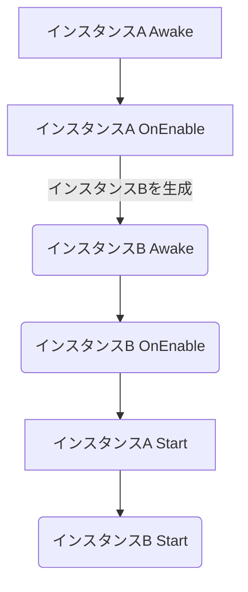
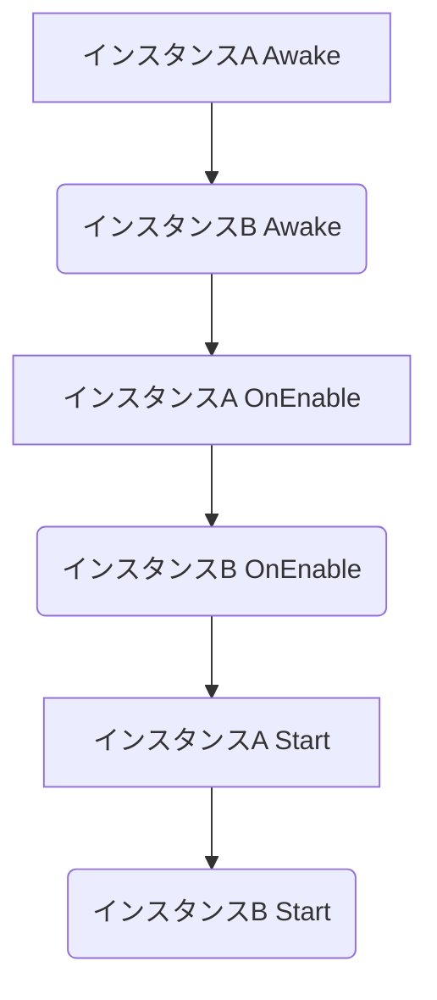

# 🐧イベント実行順序を知ることの何が大事なの？
 - Unityのイベント実行順序を把握しておかないと、予期せぬタイミングで処理を呼び出してバグを生む可能性があります。
 - 実行順序を押さえた上で開発することで安全なコーディングができ、既存のプロジェクトコードの罠を防ぐことができます。
 - 筆者もUnity使って雰囲気で開発をしている状態の時に、**Awake**, **Start**, **Update**周りで混乱した経験があるのでここに残しておきます。
 - この記事はUnity開発する人が最低限持っていてほしい知識というレベルの内容になります。
 - 詳しいイベント実行順序について知りたい方は下記URLの公式ドキュメントをご参照ください。
https://docs.unity3d.com/ja/2022.3/Manual/ExecutionOrder.html#FirstSceneLoad
# 🐧大まかなライフサイクルを知ろう！
 - Unityのイベントを大きい括りで見てみると下記のような順番で動いています。
 
     1. 初期化処理
        - Awake, Startなど
     2. ループ処理（物理演算）
        - FixedUpdate, OnTriggerXXX, OnCollisionXXXなど
     3. 入力イベント処理
        - OnMouseXXXなど
     4. ループ処理（ゲームロジック）
        - Update, LateUpdateなど
     5. 描画処理（シーン）
     6. 描画処理（UI）
        - OnGUI

 - Unityでの開発が未経験な方であればこの実行順序だけでも頭の片隅に置いて帰ってください。 さらに各項目の実行順序について見ていきます。
# 🐧初期化処理の実行順序を知ろう！
 - まず最初に気になるのが初期化処理だと思います。
 - Unityオブジェクトでの初期化処理は以下があります
### Awake
 - この関数は**必ずStart関数の前**および**プレハブのインスタンス化直後**に呼び出される処理です。
 - GameObjectが無効の場合は呼ばれません。ただし、GameObjectが有効でスクリプトコンポーネントが無効であっても呼ばれます。
 - インスタンスが有効化された時点で**最初に一度だけ**呼ばれます。
### OnEnable
 - この関数はインスタンスが有効化されるときに呼び出される処理です。
 - インスタンスが有効化される**たび**に呼ばれます。
### Start
 - この関数は**最初のUpdateフレームの前**に呼び出される処理です。
 - ただし、インスタンスが無効の場合は呼ばれません。
 - インスタンスが有効化された時点で**最初に一度だけ**呼ばれます。

 - Unityの実行順序において、Awake、OnEnable、Startの順序は個々のインスタンス内で保持されます。
 - そして異なる**インスタンス間の順序はシーン内の配置や生成順序**によって影響を受けます。
  
 - これで初期化の順番は把握できたと思います。
 - しかし、実際はシーンに予め設置しているインスタンスと動的に生成されるインスタンスが入り乱れると思います。

# 🐧実際のケースで初期化処理の実行順序を見てみよう！
### Q1 全てのインスタンスが予めシーン上に設置している場合はどうなる？
 1. シーンのロード時、シーン上の全インスタンスのAwakeが呼ばれます。
 2. 次に、全インスタンスのOnEnableが呼ばれます。
 3. 最後に、全インスタンスのStartが呼ばれます。
### Q2 全てのインスタンスが動的に生成されている場合はどうなる？
 1. インスタンス生成直後にAwakeが呼ばれます。
 2. 次に、インスタンスが有効化されるとOnEnableが呼ばれます。
 3. 最後に、Updateフレーム前にStartが呼ばれます。
### Q3 シーン上のインスタンスの初期化処理でインスタンスを生成した場合はどうなる？
 - **ex1) シーン上の"インスタンスA"のAwakeで"インスタンスB"を生成した場合**
     1. `インスタンスA`のAwakeが呼ばれる。
     2. `インスタンスA`のAwake内で`インスタンスB`を生成すると、その時点で`インスタンスB`のAwakeが呼ばれる。
     3. `インスタンスA`のOnEnableが呼ばれる
     4. `インスタンスB`のOnEnableが呼ばれる
     5. 次のUpdateフレームの前に、`インスタンスA`のStartが呼ばれる。
     6. `インスタンスB`のStartが呼ばれる。

 
 - **ex2) シーン上の"インスタンスA"のOnEnableで"インスタンスB"を生成した場合**
     1. `インスタンスA`のAwakeが呼ばれる。
     2. `インスタンスA`のOnEnableが呼ばれる。
     3. `インスタンスA`のOnEnable内で`インスタンスB`を生成すると、その時点で`インスタンスB`のAwakeが呼ばれる。
     4. 次に、`インスタンスB`のOnEnableが呼ばれる。
     5. 次のUpdateフレームの前に、`インスタンスA`のStartが呼ばれる。
     6. `インスタンスB`のStartが呼ばれる。

### Q4インスタンスのフィールドで別のインスタンスを持っている場合はどうなる？
 - `インスタンスA`と`インスタンスB`の両方が有効になっていると仮定します。
 1. `インスタンスA`のAwakeが呼ばれ、`インスタンスB`のAwakeが呼ばれます。
 2. `インスタンスA`のOnEnableが呼ばれ、`インスタンスB`のOnEnableが呼ばれます。
 3. `インスタンスA`のStartが呼ばれ、`インスタンスB`のStartが呼ばれます。

# 🐧注意点
### シーン上にあるぞれぞれのインスタンスの処理順ってどうなるの？
 - 基本的にはシーン（Inspector）の上から順にロードされてますが必ずしも順序は保証されていません。
 - 確実に順序を保証するためには別途対策が必要です。
     - Script Execution Orderの設定
         - 予めスクリプトの順序を指定できます。
     - シーン上の初期化処理をまとめる
         - 一つのスクリプトで明示的に初期化を呼び出すことで順序を保証します。
### Awakeのややこしい呼び出し条件
 - `GameObject`に`Test`というスクリプトをアタッチしているとします。
 - `GameObject`が無効の場合は、`Test`の初期化処理は呼ばれません。
 - `GameObject`が有効で`Test`スクリプトが無効の場合、Awakeのみ呼ばれます。
 - Awakeはオブジェクトが有効でインスタンスが生成されたら必ず呼ばれます。

